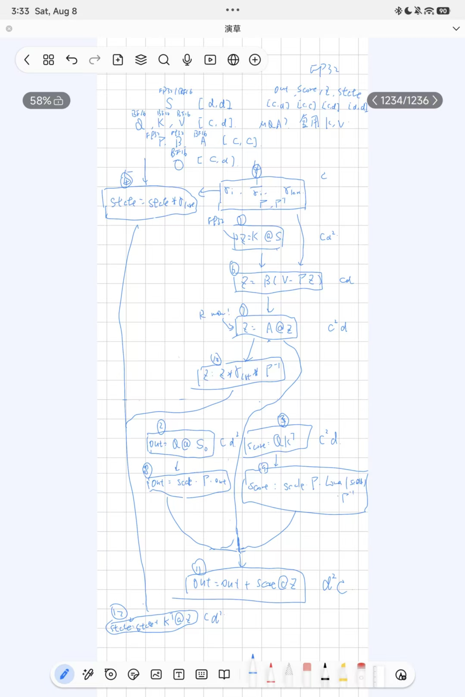

# 优化步骤

## step1

通过阅读实验文档，发现等价数学变换是一种可行的方法。但是数学变换会影响计算模式、访存模式，所以我们应该先定下来数学形式。

通过查阅FlashQLA，FLA，Flahlnfer的实现，我发现FlashQLA的实现跟我们的推导很类似，只不过做了一个小修改。

我们推导中需要计算 $U,V$ 这两个中间矩阵，而FlashQLA直接把 $U - WS$ 作为一个整体，计算 $U - WS = AB(V - \Gamma KS)$。

两种方法谁更好？我们先看一下它们各自的计算量。

对于文档中的方法，计算 $U = ABV$ 需要 $C^2 + C^2 d$，计算 $W = AB\Gamma K$ 按照最优方案需要 $C + C^2 + C^2 d$，计算 $Z = U - WS$ 需要 $Cd^2 + Cd$。这里 $d = d_k = d_v$。一共需要 $2C^2 d + Cd^2 + Cd + 2C^2 + C = 2113600$ 次。

对于FlashQLA的方法，需要 $Cd^2 + 2Cd + C^2 = 1069056$ 次。

对比下来，显然FlashQLA的计算量要低不少。并且这种方法自动完成了kernel fusion（原始方法我们会把 $U,V$ 的计算分离，因为它们没有依赖链），也减少了memory压力。

所以我们先采用了这个变换，实测取得了 $1.53\times - 2.11\times$ 的优化效果，基本符合预期。

## step2

先不急着profile，有一些非常显然的优化我们可以采用。

比方说我们可以把 $\gamma$ 的那个exp计算提在循环外算了。这个取得了1.016 - 1.035x的优化。

## step3

是时候进行一下profile看一眼瓶颈在哪了。并且也是时候根据case的数据模式进行分析。

我们先看case。简单来说，除了correctness test以外，这些case大概可以按照并行度大小分成两类。并行度小的有4个chain，并行度大的有64个chain。并行度大小会很大程度上影响我们的策略，所以这里最好写两个策略。

再看profile结果。

现在shared memory 115KB/block，202 threads/block，51712 regs/block，这说明我们没办法在一个SM上塞两个block。这很大程度上影响了我们的并行度。

此外，很多case自己的并行度（$\mathbb{B}^{*}\mathbb{H}\mathbb{V}$）就不高。

对long_low_gva进行profile，发现mem和compute的利用率都很低。这证实了我们的猜想，当前的问题是latency bound，主要思路是用更高的并行度掩盖掉latency。

这时我们发现一个非常重要的特性：state与out的更新在 $d_v$ 维度是彼此独立的。也就是说我们可以从 $d_v$ 维度凭空切分出更高的并行度出来。

尝试之后，发现在当前版本下，只有chain_equal case取得了1.16x的收益，别的case反而略有下降。因为切分之后会有重复的Q@K^T计算，所以当前收益不大是正常的。也许随着我们的进一步优化，切分 $d_v$ 会更有前景（毕竟现在理论并行度上限也不高，我们想进一步做切分 $d_v$ 还得优化fragment和shared memory占用）。

## step4

我们发现shared memory占用并不算高，所以考虑使用pingpong buffer做prefetch，这基本上是免费的收益。

对哪些tensor做pingpong prefetch呢？观察发现，只有K是从头到尾一直在用，而像是Q很快就销毁了，像是s可以从fragment中直接读，像是v使用之前有一次gemm。总之对K使用pingpong buffer最有性价比，而对别的可以尝试直接用计算把latency掩盖掉。

尝试对K做pingpong，得到1.01 - 1.03x的优化。确实很小，但是似乎也太小了。

尝试分析原因。首先理论计算表明，当前计算强度为63.18 FLOP/B，虽然还不是很高但也不算很低。

其次，进一步profile表明，当前的computation占用 $20.06\%$，mem占用41.97%，说明目前仍然是latency / parallelism bound，我们下一步目标是隐藏latency / 进一步提高并行度。

查看stall reason，发现stall_long_scoreboard居然高达5.16 CPI，stall_barrier也有2.15。

## step5

这里stall_long_scoreboard是由于内存访问导致的。进一步的profile表明这里 $65.3\%$ 落在Q load路径，$14.9\%$ 落在A load，$7.2\%$ 落在V load。

因为我们还没有调整计算顺序，所以我们先对Q+K都做pingpong buffer，然后对V，A也做prefetch。

取得了1.32 - 1.34x的加速。其中stall_long_scoreboard已经下降到2.2 CPI，进一步采样，发现剩余long scoreboard主要是pipeline第一次进入时的latency，所以进一步优化空间已经没有那么大了。

## step6

这时我们发现，stall_barrier已经成为主要问题。不难想到，这里barrier主要是在一次GEMM完成后立刻进行element-wise运算导致的，不过我们可以通过调整计算顺序来隐藏掉这部分latency。

我们先画一个图，把依赖关系分析出来。

由图可以清晰看出，我们有四条相对独立的计算链，其中state那条链是导致我们只能串行计算的罪魁祸首（虽然我们也无法优化就是了）。

不难发现这里有三个GEMM可以同时发射，之后再接element-wise的运算，应该可以隐藏掉一部分latency。这里的运算顺序已经在图中标注出来了。

实测得到了1.01 - 1.08x优化。而且stall_barrier反而升高了。

经过进一步 profile，发现是因为我们在 kernel 最开始把数据从 fragment 搬运到 shared memory 上导致的。这个操作是为了适配 tilelang 对 GEMM 中 B 矩阵的要求（只能为 shared memory），然而 A 矩阵可以在 fragment 上。所以我们尝试对矩阵进行转置。

转置之后，我们不光免去了一些从 fragment 搬到 shared memory 上的 latency，同时由于我们的 A 矩阵直接就是 fragment，想必会减少 tilelang 实现 GEMM 的时间。

最终取得了 1.33 - 1.49x 的优化，非常显著。并且 profile 结果表明当前 stall_long_scoreboard 已经下降到 0.19 CPI，stall_barrier 已经下降到 0.56 CPI。

既然我们已经做了这么多优化了，下一步就是继续尝试对不同的 $B \times H_v$ 找到最合适的 $d_v$ 切分维数。不过在此之前，我们应该优化一下 fragment 和 shared memory 占用。

发现目前 shared memory 是瓶颈，为了减小这个占用，我们可以考虑少用一些 pingpong buffer，或者对生命周期不重叠的 shared memory 进行复用。发现 score_shared 和 output_shared 是不重叠的，于是我们复用一下。

这时切分已经可以做到 2 blocks/SM，所以我们重新跑一遍，测试不同 $B \times H_v$ 下怎么切最合适。

然而不幸的是，仍然只有 chain_long 会使用这个切分 $d_v$ 的优化。所以整体没啥用。

这很奇怪，为什么我们把并行度拉高效果并不好？我猜测一个原因是，我们的原始版本已经用各种手段把 latency（也就是 warp stall 的部分）拉得很低了，所以并行度上来对掩盖 latency 没什么用。另一个原因可能是，我们分到的这个 MIG 有 14 个 SM，这个数非常丑，如果我们有 32 并行度的活，最后会剩一个 4 的 tail，导致掩盖了部分优化。

## step 7

目前来看，我们距离全 case 100+ pts 已经很近了。考虑再进行一次 profile，发现 profiler 给出提示：shared memory 访问时 bank conflict 太多。

通过分析可以发现，因为我们之前使用了转置矩阵，所以这里对 $V$ 的访问变成了按列的顺序访问，这会导致非常严重的 bank conflict。

有两个解决方案：把 $V$ 改成 swizzle 布局，或者直接对 $V$ 转置。

最后选择了 swizzle 解决方案，profile 结果表明 shared LSU load conflict 从 6291456 降到 0，非常显著的优化。并且各个 case 都有 1.00 - 1.16x 不等的提升，目前所有 case 均已达到 $100+$。

## step 8

阅读了 [FlashQLA](https://qwen.ai/blog?id=flashqla)，其中的 CP 部分以及利用 gate 衰减这两个给了我很大启发。但是利用 CP 似乎对我们这几个 case 有点太 heavy 了，最终我决定利用 gate 衰减来增加并行度。

---

# 最终版详解

## 写在前面

我不知道标准实现应该是怎样，但是我这个 kernel 比较有趣：它主要不是通过提高并行度来掩盖 latency 的（因为我试了，一方面是 fragment 和 shared memory 占用导致理论 occupancy 不高，另一方面是实际试下来提高并行度效果不好，适用范围很窄），而是通过手动 overlap 访存和计算，以及 overlap tensor core 和 cuda core 的计算，以及手动优化各种 stall 来实现的，把单个 block 的 latency 压得很低。

## 依赖分析

之前放过了，但是防止没看到还是再放一遍。分析就不再写一遍了，可以看上面优化步骤 step 6。

## kernel 信息

最终版进行数学变换，不再计算 $U, V$ 中间矩阵，而是直接计算 $U - WS = AB(V - \Gamma KS)$。因此相当于完成了 kernel fusion。

这个 kernel 会根据 $B^* H_v$ 初始并行度的不同，决定采纳不同的 $d_v$ 切分方式。

当 $d_v$ 切分为 $1 \times 128$（即不切分）时，fragment 占用为 192 KiB/block，shared memory 占用为 137 KiB/block，理论 occupancy 为 1 block/SM。

当 $d_v$ 切分为 $2 \times 64$ 时，我们会对每个切分出的 $d_v$ 单独开一个 block，此时 fragment 占用为 104 KiB/block，shared memory 占用为 105 KiB/block，理论 occupancy 为 2 block/SM。

在选定 $d_v$ 切分方式后，会自动选择是否利用 gate 衰减利用 CP 增加并行度。

如果没有启用，那么只运行上述进行 fusion 后的主 kernel。

如果启用了，那么会在同一 stream 中依次启动 gate warmup, state preparation, CP main 这几个 kernel。三个 kernel 分别负责决定每个分段需要向前多考虑多少个 chunk，计算每个段的起始 state，并行进行主计算。

## fragment 分配

我们一共有 256 KiB 的 fragment。

| Fragment | 作用 | D64 shape/dtype | D64 | D128 shape/dtype | D128 |
|---|---|---|---:|---|---:|
| `state_t` | recurrent state | `[64,128] FP32` | 32 KiB | `[128,128] FP32` | 64 KiB |
| `state_operand` | BF16 state operand | `[64,128] BF16` | 16 KiB | `[128,128] BF16` | 32 KiB |
| `z_t` | residual/Z accumulator | `[64,64] FP32` | 16 KiB | `[128,64] FP32` | 32 KiB |
| `z_operand` | BF16 Z operand | `[64,64] BF16` | 8 KiB | `[128,64] BF16` | 16 KiB |
| `out_t` | output accumulator | `[64,64] FP32` | 16 KiB | `[128,64] FP32` | 32 KiB |
| `score` | QK score | `[64,64] FP32` | 16 KiB | `[64,64] FP32` | 16 KiB |
| **合计** | | | **104 KiB/CTA** | | **192 KiB/CTA** |

## shared memory 分配

| Shared object | D64 | D128 | 是否 ping-pong |
|---|---:|---:|---|
| Q BF16 | 32 KiB | 32 KiB | 是，双 stage |
| K BF16 | 32 KiB | 32 KiB | 是，双 stage |
| V BF16 | 16 KiB | 32 KiB | 是，双 stage |
| A BF16 | 16 KiB | 16 KiB | 是，双 stage |
| g + beta | 1 KiB | 1 KiB | 是，双 stage |
| **Ping-pong 小计** | **97 KiB** | **113 KiB** | |
| `score_shared` | 8 KiB | 8 KiB | 否 |
| `output_shared` | 0，复用 score | 16 KiB | 否 |
| gamma + inv_gamma + gamma_last | 0.504 KiB | 0.504 KiB | 否 |
| **逻辑总量** | **105.504 KiB** | **137.504 KiB** | |
| **NCU dynamic/allocated** | **105.516/106.625 KiB** | **137.516/138.625 KiB** | |

我们对一部分 shared memory 的数据使用了 pingpong buffer，另外一部分没有用 pingpong buffer，因为没必要（虽然上面也有一些可以优化掉的，但是还没有这么做）。

## 全流程

以下仅讲述主 kernel 的流程，其余 kernel 要么不困难（naive 实现），要么就是跟主 kernel 区别不大。

我们使用 tilelang 提供的 pipeline，当进入 chunk 时可以认为 Q/K/V/A/g/beta 已经被搬入 shared memory。最开始，我们把 state 复制到 state_operand（转为 BF16 计算）。

第一、二个 GEMM，我们先发射 $z^T = (K \otimes S)^T = S^T \otimes K^T$ 以及 $out^T = (Q \otimes S)^T = S^T \otimes Q^T$，并且不立刻 wait。接下来由标量计算单元继续处理下面几步。

接下来计算 gamma，inv_gamma，gamma_last，并且顺手把 state_t 的乘 gamma 部分也做了。这样后面每次用到 gamma 的时候就不用 exp 以及除法运算了。

然后我们显式 wait 第一个 GEMM，因为马上要消费了。计算 $z^T = \beta \cdot (V^T - \gamma \cdot z^T)$（仍然是标量运算！）。

发射 $z^T = (A \otimes z)^T$ 以及 $score = Q \otimes K^T$ 两个 GEMM，仍然先不 wait。

这时 wait 第二、三个 GEMM。随后对 $z^T$ 进行一些乘 gamma 一类的标量运算。

这时 wait 第四个 GEMM，对 $out^T$ 执行 StrictLower 以及乘一些标量系数的操作。

发射 $out^T = (score \otimes z)^T$，$state += z^T \otimes K$，并且 wait 第五个 GEMM。

此时 output 已经就绪，可以发起 store 操作。

这时 wait 第六个 GEMM，此时 state 也已经就绪，可以进入下一个 chunk。

## 最终性能

10次 warmup，100次 run 的中位数。

| Case | 最终策略 | Baseline (ms) | 最终版 (ms) | 总加速比 | Baseline 预计分数 | 最终预计分数 |
|---|---:|---:|---:|---:|---:|---:|
| short_tail_state | tail, CP off | 0.289472 | 0.088480 | 3.2716x | 103.91 | 120.00 |
| chain_equal | D64, CP p4 | 1.487440 | 0.300224 | 4.9544x | 69.60 | 113.16 |
| parallel_equal | D128, CP off | 0.983408 | 0.279968 | 3.5126x | 74.28 | 116.52 |
| parallel_gva | D128, CP off | 0.958384 | 0.255584 | 3.7498x | 73.71 | 118.47 |
| long_low_gva | D128, CP p8 | 6.924480 | 1.294352 | 5.3498x | 66.84 | 108.72 |
| batch_split_gva | D128, CP off | 6.019296 | 1.343280 | 4.4810x | 65.51 | 102.81 |
| wide_gva_state | D128, CP off | 11.202448 | 2.267184 | 4.9411x | 64.48 | 101.41 |
| deep_gva_state | D128, CP off | 12.145824 | 2.591536 | 4.6867x | 64.96 | 101.85 |
| **平均预计分数** | | | | | **72.91** | **110.37** |

这里 p4, p8 表示把整个序列切分成多少段。

## 尝试过的方案

有点太多了，在尝试的过程中回滚了非常多方案。

比如在最后一轮 swizzle 时，曾经考虑过由于 $g$ 是 $[B, T, H_v]$，而我们每个 block 内部是固定 B，H_v 的，这就导致访问的时候有一个 stride，可能导致 copy 的时候并不方便。

优化方法就是开一个预处理 kernel，进行一下转置。然而实测表明在 wide case 上有负优化，在 deep case 上收益很小并且不稳定。所以最后没有采纳。

猜测是因为额外发射 kernel 带来的 overhead 导致的。其实我还攒了很多需要多发一个预处理 kernel 的优化，如果我最终设计选择多用一个 kernel 的话，没准把这些优化都加上比我现在做得还要好。

但是我做了这么多优化 latency 的工作，很想看一看单 kernel 能优化到什么地步。所以目前实现的是除去 CP 部分以外是单 kernel 的版本。如果是真的在实践中遇到这个问题，我应该会同时优化两个版本。